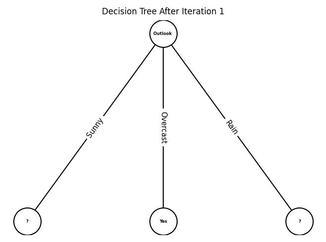
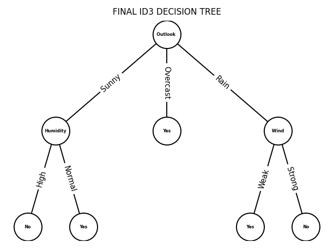
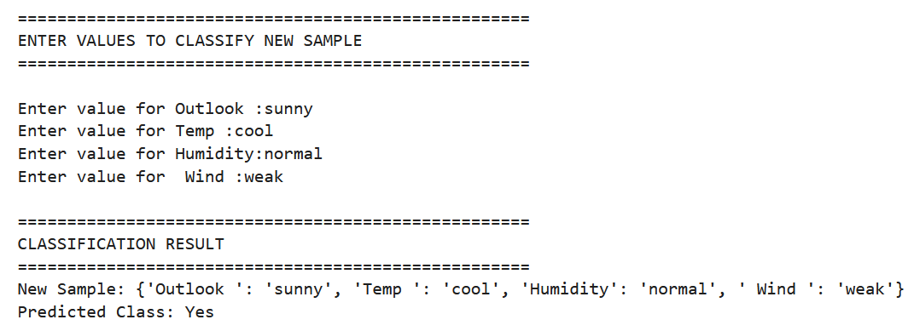

# 🌳 ID3 Decision Tree Classifier

<div align="center">


-orange)


### 📚 A Complete Implementation of the ID3 Decision Tree Learning Algorithm in Python

Builds a Decision Tree from scratch using **Entropy** and **Information Gain**, visualizes the tree at every iteration, generates IF-THEN decision rules, and predicts classes for new samples.

</div>

---

## 📑 Table of Contents

* [📌 Overview](#-overview)
* [🎯 Project Objectives](#-project-objectives)
* [✨ Features](#-features)
* [🧠 Algorithm Concepts](#-algorithm-concepts)
* [⚙️ Algorithm Workflow](#️-algorithm-workflow)
* [📊 Dataset Format](#-dataset-format)
* [🖼️ Output Preview](#️-output-preview)
* [🌳 Decision Tree Visualization](#-decision-tree-visualization)
* [📂 Project Structure](#-project-structure)
* [🛠️ Technologies Used](#️-technologies-used)
* [📦 Requirements](#-requirements)
* [🚀 Installation](#-installation)
* [▶️ Running the Project](#️-running-the-project)

  * [☁️ Google Colab](#️-google-colab)
  * [📓 Jupyter Notebook](#-jupyter-notebook)
  * [💻 Local Python Environment](#-local-python-environment)
* [🔍 Sample Classification](#-sample-classification)
* [📄 Project Report](#-project-report)
* [🚀 Future Enhancements](#-future-enhancements)
* [👨‍💻 Author](#-author)

---

## 📌 Overview

The **ID3 (Iterative Dichotomiser 3)** algorithm is one of the foundational algorithms used in machine learning for decision tree construction.

This project demonstrates how a decision tree is built **without using Scikit-Learn or any machine learning framework**.

The implementation includes:

✅ Entropy Calculation

✅ Information Gain Calculation

✅ Best Attribute Selection

✅ Recursive Tree Construction

✅ Rule Generation

✅ Tree Visualization

✅ Classification of New Samples

---

## 🎯 Project Objectives

🔹 Understand the mathematical foundation of Decision Trees

🔹 Implement ID3 from scratch

🔹 Visualize tree growth after every iteration

🔹 Generate human-readable decision rules

🔹 Classify unseen data samples

🔹 Learn Information Theory concepts used in Machine Learning

---

## ✨ Features

### 📥 Data Processing

* Reads dataset from Excel (.xlsx)
* Removes ID column automatically
* Cleans and standardizes text values
* Handles categorical datasets

### 🧮 Entropy Calculation

* Calculates dataset entropy
* Calculates entropy for each attribute value
* Displays intermediate calculations

### 📈 Information Gain

* Computes Information Gain for every feature
* Selects the best attribute automatically
* Displays gain values for comparison

### 🌳 Decision Tree Construction

* Recursive implementation of ID3
* Dynamic branch generation
* Iteration-wise tree growth

### 📜 Rule Generation

Automatically generates rules such as:

```text
IF Outlook = Sunny
AND Humidity = High
THEN Play = No
```

### 🎨 Visualization

* NetworkX-based tree generation
* Matplotlib rendering
* Tree displayed after each iteration
* Final tree visualization

### 🔍 Prediction

* Accepts user input
* Traverses decision tree
* Predicts target class

---

## 🧠 Algorithm Concepts

### 📚 Entropy

Measures uncertainty in a dataset.

```text
Entropy(S) = -Σ p(x) log₂ p(x)
```

### 📊 Information Gain

Measures reduction in entropy after splitting on an attribute.

```text
Gain(S,A) = Entropy(S) − Weighted Entropy(A)
```

### 🌳 ID3 Algorithm

1. Calculate entropy.
2. Calculate Information Gain.
3. Select best attribute.
4. Split dataset.
5. Repeat recursively.
6. Build final decision tree.

---

## ⚙️ Algorithm Workflow

```text
Dataset
   │
   ▼
Calculate Entropy
   │
   ▼
Calculate Information Gain
   │
   ▼
Select Best Attribute
   │
   ▼
Split Dataset
   │
   ▼
Create Tree Node
   │
   ▼
Repeat Recursively
   │
   ▼
Final Decision Tree
   │
   ▼
Prediction
```

---

## 📊 Dataset Format

The dataset should be provided in Excel format.

### Example Dataset

| ID | Outlook  | Temperature | Humidity | Windy | Play |
| -- | -------- | ----------- | -------- | ----- | ---- |
| 1  | Sunny    | Hot         | High     | False | No   |
| 2  | Sunny    | Hot         | High     | True  | No   |
| 3  | Overcast | Hot         | High     | False | Yes  |
| 4  | Rain     | Mild        | High     | False | Yes  |

### Rules

* First column → ID column
* Last column → Target/Class column
* All attributes should be categorical

---

## 🖼️ Output Preview

### Entropy Calculation

```text
Entropy of Dataset = 0.9403
```

### Information Gain

```text
Gain(Outlook) = 0.2467
Gain(Humidity) = 0.1518
Gain(Windy) = 0.0481
```

### Best Attribute

```text
Best Attribute Selected = Outlook
```

---

## 🌳 Decision Tree Visualization

### Iteration 1



### Final Decision Tree




### Sample Prediction




---

## 📂 Project Structure

```text
ID3-Decision-Tree-From-Scratch/
│
├── data/
│   └── dataset.xlsx
│
├── notebooks/
│   └── ID3_Decision_Tree.ipynb
│
├── reports/
│   ├── Project_Report.pdf
│   └── Sample_Output.pdf
│
├── images/
│   ├── tree_iteration_1.png
│   └── final_tree.png
│
├── requirements.txt
│
├── README.md

```

---

## 🛠️ Technologies Used

| Technology          | Purpose           |
| ------------------- | ----------------- |
| 🐍 Python           | Core Programming  |
| 📊 Pandas           | Data Processing   |
| 🌐 NetworkX         | Tree Construction |
| 📈 Matplotlib       | Visualization     |
| 📓 Google Colab     | Execution         |


---

## 📦 Requirements

Required libraries:

```text
pandas
networkx
matplotlib
math
```

---

## 🚀 Installation

```bash
git clone https://github.com/Daksh-Sahu/decision-tree-classifier.git

cd decision-tree-classifier

```

---

## ▶️ Running the Project

### ☁️ Google Colab (Preferred)

1. Open notebook.
2. Upload dataset in Files section.
3. Run all cells.
4. Enter file path.

Example:

```python
/content/dataset.xlsx
```

### 📓 Jupyter Notebook

```bash
jupyter notebook
```

Open:

```text
notebooks/ID3_Decision_Tree.ipynb
```

Dataset path:

```python
data/dataset.xlsx
```

### 💻 Local Python Environment

```bash
python id3_decision_tree.py
```

---

## 🔍 Sample Classification

```text
Enter value for Outlook: Sunny
Enter value for Temperature: Cool
Enter value for Humidity: High
Enter value for Windy: False
```

Output:

```text
Predicted Class: No
```

---

## 📄 Project Report

📘 Detailed implementation report:

```text
reports/Project_Report.pdf
```

📑 Sample execution and screenshots:

```text
reports/Sample_Output.pdf
```

---

## 🚀 Future Enhancements

* 📈 Tree Pruning
* 📊 Accuracy Evaluation
* 🌐 Web Application Interface
* 🖥️ Desktop GUI
* 📄 PDF Report Export
* 📉 Support for Continuous Features
* 🤖 Comparison with Scikit-Learn

---

## 👨‍💻 Author

**Daksh Sahu**

Python Developer • Data Science Enthusiast • Machine Learning Learner

⭐ If you found this project useful, consider starring the repository.
